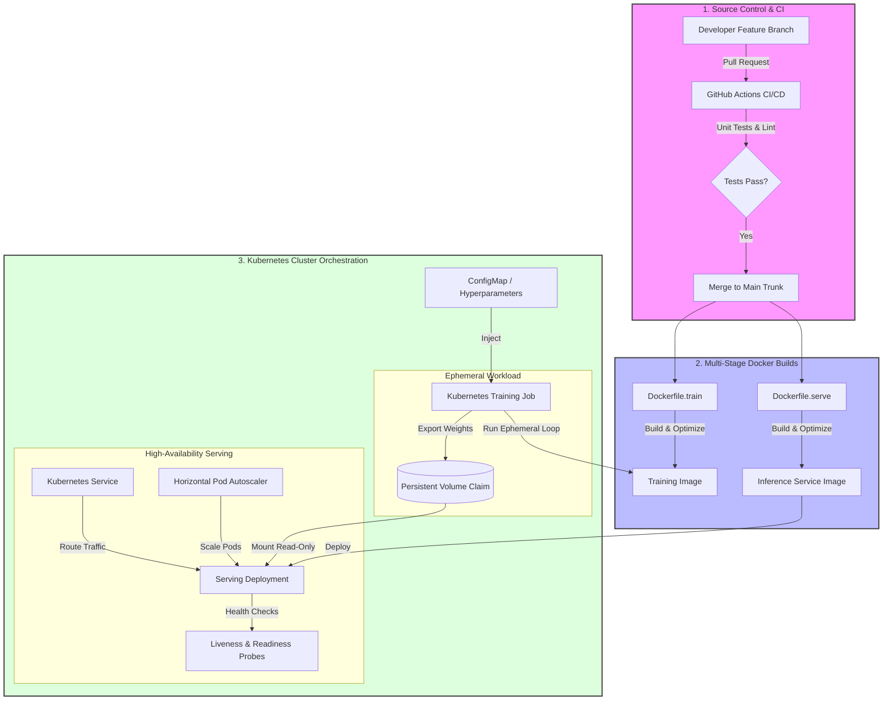

### MLOps Pipeline: Containerized PyTorch Training and Orchestrated Kubernetes Serving

### 📋 Course Information & Assignment Metadata

* **Course Title:** MLOps & Infrastructure for Machine Learning
* **Assignment Identifier:** Assignment 3 — Deploying PyTorch ML Workloads with Docker & Kubernetes
* **Project Type:** Individual Assignment
* **Timeline:** Active through the end of the semester

### 🎯 Project Overview

This project establishes a production-grade machine learning lifecycle for an image classification workflow. The pipeline spans across four distinct engineering operational phases: 

1. **Source Control & Collaboration:** Enforcing standardized branching protocols, peer-reviewed integration requests, automated verification pipelines, and decoupled environment configurations.
2. **Modular PyTorch Implementations:** Developing structured training loops that consume dynamic properties, emit predictable telemetry logs, and export reproducible model artifacts alongside decoupled, lightweight prediction APIs.
3. **Optimized Containerization:** Crafting resource-aware, multi-stage runtime environments optimized for compute-heavy workloads and secure, isolated inference endpoints.
4. **Cloud-Native Cluster Orchestration:** Scheduling autonomous batch training tasks on distributed nodes and deploying resilient, self-healing, auto-scaling model delivery layers.

### 🧠 Core Learning Objectives

By completing this infrastructure pipeline, practitioners demonstrate proficiency in: 

* **Repository Architecture & Git Ops:** Constructing standard workspace topologies, isolation profiles, semantic log messaging, and branch protections.
* **Efficient Image Compilation:** Isolating compilation dependencies from runtime layers to reduce attack vectors and optimize image layers for deep learning.
* **Batch Workload Scheduling:** Offloading ephemeral training workloads to cluster processes backed by isolated persistent storage definitions.
* **Highly Available Ingress Serving:** Running decoupled prediction microservices protected by rolling deployments, proactive liveness monitors, and traffic endpoints.
* **Decoupled Topology Injection:** Separating operational hyperparameters and runtime secrets from the core system application logic.

### 🛠️ System Prerequisites

Executing this multi-stage ecosystem requires access to the following toolchains and environments: 

* **Runtime Environment:** Python engine (version 3.10 or higher) paired with functional deep learning framework experience.
* **Engine Isolation:** Local container engine installation or an accessible virtual machine running an active container virtualization daemon.
* **Orchestration Client:** Command-line administrative utility tailored for cluster communication.
* **Cluster Environment:** A standardized local Kubernetes distribution or a fully provisioned cloud-managed orchestration engine.
* **Version Control Hub:** A public user account hosted on a cloud-based source code distribution platform.

### 🏗️ System Architecture Diagram



### 📁 Repository Structure Blueprint

The version-controlled project hub must adhere precisely to the hierarchical organization outlined below:

```text
mlops-pytorch-pipeline/
├── README.md
├── .gitignore
├── .github/
│   └── workflows/
│       └── ci.yml
├── src/
│   ├── train.py
│   ├── model.py
│   └── dataset.py
├── serve.py
├── configs/
│   └── training_config.yaml
├── docker/
│   ├── Dockerfile.train
│   └── Dockerfile.serve
├── k8s/
│   ├── namespace.yaml
│   ├── training-job.yaml
│   ├── serving-deployment.yaml
│   ├── serving-service.yaml
│   ├── configmap.yaml
│   └── hpa.yaml
├── requirements/
│   ├── train.txt
│   └── serve.txt
└── tests/
    └── test_model.py
```

### 📝 Phase Breakdowns & Architectural Specifications

### Part A: Strict Version Control Workflow

* **Lineage Architecture:** Establish a dedicated development branch branched directly from the protected master trunk. All experimental features must live on individual, semantic sub-branches.
* **Integration Restrictions:** Direct push access to the master trunk is blocked. Code promotion requires generating a formal pull request containing holistic summaries.
* **Pacing Requirements:** A minimum distribution of multiple integration reviews must be executed and merged during the first half of the project timeline, followed by an equivalent cadence during the second half.
* **Semantic Log Conventions:** Commit descriptions must reflect uniform structural prefixes denoting the nature of the change (such as structural additions, fixes, documentation, or tooling tweaks).
* **Automated Guardrails:** An integrated workflow engine must run upon review registration to ensure structural validation and unit tests pass prior to trunk merging.

### Part B: Decoupled PyTorch System Architecture

* **Structural Representation:** A convolutional model or optimized transfer-learning layout designed for multi-class image feature isolation.
* **Data Ingestion Engine:** Abstracted dataset pipelines incorporating standard spatial transforms, tensors normalization, and batch workers.
* **Execution Routine:** A loop engine configured to parse parameters out of structured external properties, emit telemetry metrics directly to standard outputs using structured notation, support early truncation mechanics, and export physical model weights to a targeted volume path.
* **Service Framework:** An interface layer configured to ingest exported weights, expose an analytical ingress path for processing image payloads, and expose an administrative path for reporting operational state viability.

### Part C: Containerized Workload Multi-Staging

* **Training Context Layer:** A multi-stage architecture utilizing a lean base foundation to download deep learning libraries, caching layers cleanly, separating configurations from application logic, and setting standard entrypoints.
* **Prediction Service Layer:** A hyper-lean container excluding all heavy training libraries, exposing only specific internal application endpoints, enforcing operations under a restricted, unprivileged identity profile, and evaluating microservice availability via embedded wellness checks.
* **Verification Protocols:** Requirement to validate image generation locally, mounting directories to host operating systems for checkpoint retrieval, and logging confirmation via evidence attachments in integration requests.

### Part D: Orchestrated Ephemeral Training Jobs

* **Logical Isolation:** Separate infrastructure resources through dedicated, named cluster boundaries.
* **Abstract Properties:** Maintain hyperparameter properties in independent cluster dictionaries mapped directly into training application paths.
* **State Preservation:** Configure persistent shared storage claims to ensure training weights survive past the container termination sequence.
* **Compute Restrictions:** Impose rigid lower requests and upper caps on computational processing elements and memory spaces. Optional integration profiles allow specialized hardware card scheduling alongside tailored placement constraints.

### Part E: High-Availability Resilient Inference Serving

* **Horizontal Redundancy:** Enforce concurrent, multi-replica application scaling inside the network topology.
* **Read-Only Storage:** Mount historical training storage volumes into prediction runtimes using read-only access flags.
* **Resiliency Ingress Probes:** 
  * An automated evaluation probe mapping endpoints regularly to cycle deadlocked instances.
  * A readiness pipeline checking availability thresholds before allowing traffic ingestion.
* **Traffic Balancing:** Establish a native network routing interface mapping public-facing target ports directly to internal container executions.
